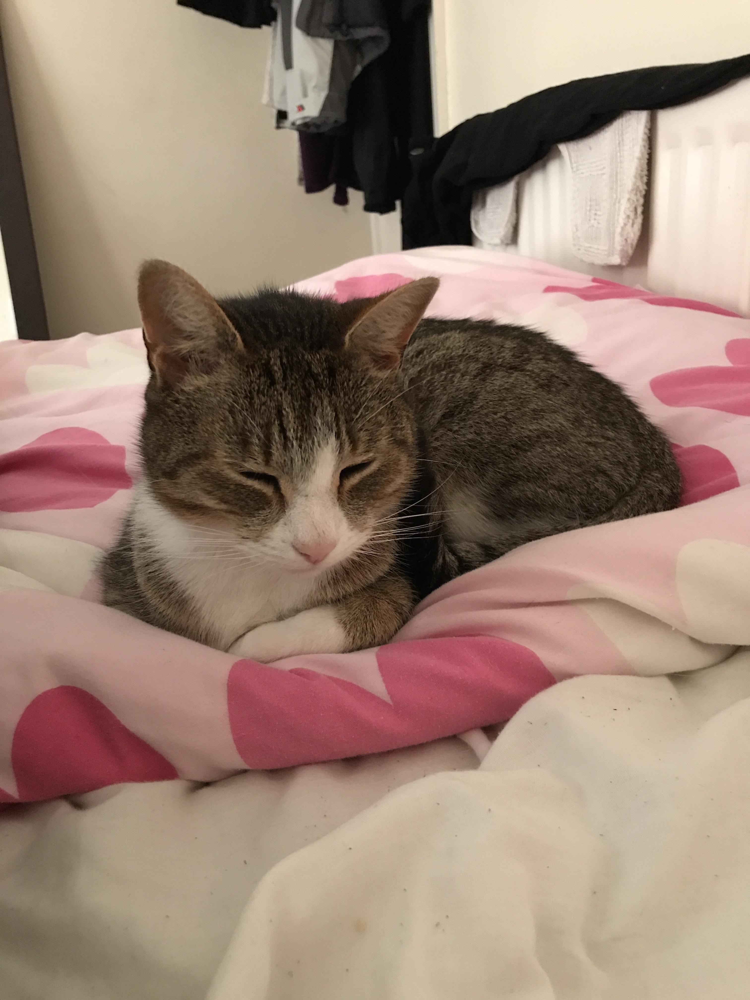

# Mais ... c'est quoi Open API ?
<!-- .slide: data-state="no-toc-progress" class="no-toc-progress" -->

----

## Une spécification
<!-- .slide: data-state="no-toc-progress" class="no-toc-progress" -->
[OpenAPI 3.0.1](https://github.com/OAI/OpenAPI-Specification/blob/master/versions/3.0.1.md)

----

## Et du coup ?
<!-- .slide: data-state="no-toc-progress" class="no-toc-progress" -->
[Des chocapics](https://raw.githubusercontent.com/OAI/OpenAPI-Specification/master/examples/v3.0/petstore.yaml)

----

## Génération de la spec
<!-- .slide: data-state="no-toc-progress" class="no-toc-progress" -->
* Une petite démo ?
[JAX-RS](https://github.com/swagger-api/swagger-core/wiki/Swagger-2.X---Getting-started)  

----

## Swagger-ui
<!-- .slide: data-state="no-toc-progress" class="no-toc-progress" -->
[https://petstore.swagger.io/](https://petstore.swagger.io/)  
[https://github.com/swagger-api/swagger-ui](https://github.com/swagger-api/swagger-ui)

----

## Swagger-editor
<!-- .slide: data-state="no-toc-progress" class="no-toc-progress" -->
[http://editor.swagger.io/](http://editor.swagger.io/)  
[https://github.com/swagger-api/swagger-editor](https://github.com/swagger-api/swagger-editor)

----

## Et bien d'autres
<!-- .slide: data-state="no-toc-progress" class="no-toc-progress" -->
[https://any-api.com/](https://any-api.com/)
[https://zenika.cloud.tyk.io/portal/apis/](https://zenika.cloud.tyk.io/portal/apis/)

----

## Tl;dr
<!-- .slide: data-state="no-toc-progress" class="no-toc-progress" -->
* Standard de documentation d'API
* Automatisé & automatisable
* Pas cher
* Généralisable

Vive la doc \o/

----

<!-- .slide: data-state="no-toc-progress" class="no-toc-progress" -->

<!-- .element height="20%" width="50%" -->